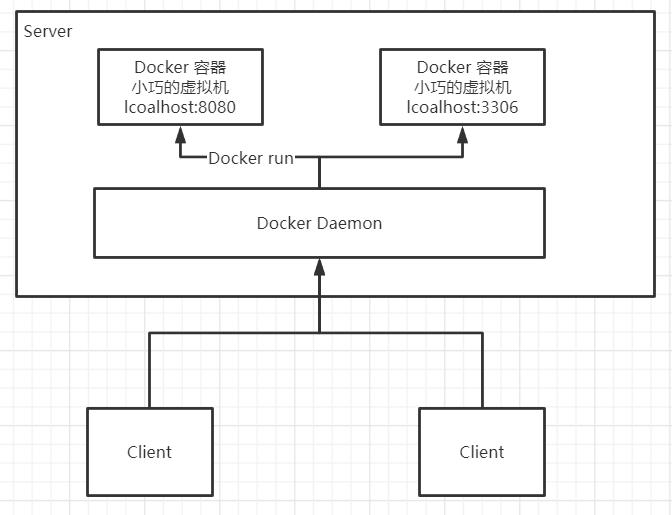
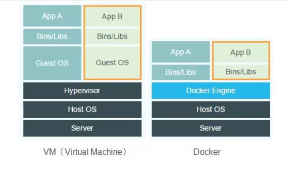

*弱小和无知不是生存的障碍，傲慢才是*


# Docker 概述

## Docker为什么出现？

一款产品开发、线上至少有两套环境，每一台机器都要配置环境，费时费力，并且有一些配置时不跨平台的。

java -> api -> 发布（应用商店） -> 下载api -> 安装即用

java -> jar -> 打包项目带上环境（镜像）-> Docker仓库（商店）-> 下载我们发布的镜像 -> 直接运行

Docker的思想打包装箱，互相隔离。通过隔离机制，将服务器利用到极致！


## Docker历史

2010 公司成立

2013 开源

2014 Docker 1.0 发布


> 聊聊Docker 

Docker 是 go 语言开发

https://docs.docker.com/  官方文档，非常详细

https://hub.docker.com/ Docker镜像仓库，有 push 和 pull 操作


## Docker对比

| Feature        | Vwware虚拟机软件 | Docker     |
| -------------- | ---------------- | ---------- |
| 实现方式       | 虚拟化技术       | 容器化技术 |
| 隔离           | 是               | 是         |
| 完整的操作系统 | 是               | 否         |
| 资源占用       | 几G              | 几M        |
| 启动           | 几分钟           | 几秒       |
| 操作步骤       | 冗余步骤多       | 无         |


> 容器化架构对比

|        | 容器化                               | 虚拟化                     |
| ------ | ------------------------------------ | -------------------------- |
| 内核   | 没有自己的内核，直接依赖宿主机的内核 | 虚拟硬件，有完整的操作系统 |
| 环境库 | 每个容器有独立的环境库               | 共享环境库                 |
| 隔离性 | 容器之间互相隔离，且有自己的文件系统 | 没有隔离环境               |


## Docker用途

> DevOps（两个单词组合    开发、运维）

1. 应用更快速的交付和部署

传统：一堆帮助文档，安装程序

Docker：打包镜像发布测试，一键运行


2. 更便捷的升级和扩容

使用Docker之后，部署应用就和搭积木一样

环境升级、水平扩容


3. 更简单的系统运维

在容器化之后，我们的开发、测试环境都高度一致


4. 更高效的计算资源利用

Docker 是内核级别的虚拟化，可以在一个物理机上运行很多的容器实例！服务器的性能可以压榨到极致


## Docker名词

1. 镜像：Images，相当于 Java 的类

Docker 镜像相当于模板，通过运行镜像创建多个容器


2. 容器：Containers，相当于 Java 的对象（类的实例化）

Docker利用容器技术，独立运行一个或一组应用，容器由镜像创建。

启动、停止、删除

可以理解容器是一个简易的linux操作系统


3. 仓库：Repository

仓库是存放镜像的地方

仓库分为共有仓库和私有仓库

需要配置镜像加速


# Docker安装

> 基于 CentOS 7 安装

1. 官网安装参考手册：https://docs.docker.com/engine/install/centos/

2. 确定你是CentOS7及以上版本，系统内核是 3.10 以上

    ```
    [root@centos7 ~]# cat /etc/redhat-release
    CentOS Linux release 7.9.2009 (Core)
    [root@centos7 ~]# uname -r
    3.10.0-1127.19.1.el7.x86_64
    ```

3. yum安装gcc相关

    ```
    yum -y install gcc
    yum -y install gcc-c++
    ```

4. 卸载旧版本

    ```
    yum -y remove docker docker-common docker-selinux docker-engine
    # 官网版本
    yum remove docker \
              docker-client \
              docker-client-latest \
              docker-common \
              docker-latest \
              docker-latest-logrotate \
              docker-logrotate \
              docker-engine
    ```

5. 安装需要的软件包

    ```
    yum install -y yum-utils device-mapper-persistent-data lvm2
    ```

6. 设置镜像仓库

    ```
    # 正确推荐使用国内的
    yum-config-manager --add-repo http://mirrors.aliyun.com/docker-ce/linux/centos/docker-ce.repo
    ```

7. 更新yum软件包索引（因为上面更新了yum源）

    ```
    yum makecache fast
    ```

8. 安装Docker CE （C E表示Community Edition）

    ```
    yum -y install docker-ce docker-ce-cli containerd.io
    ```

9. 启动docker

    ```
    systemctl start docker
    ```

10. 测试

    ```shell
    docker version
    docker run hello-world #使用镜像
    docker images #查看已下载的镜像
    #--------------------------------------------------
    
    [root@centos7 ~] docker run hello-world
    Unable to find image 'hello-world:latest' locally
    latest: Pulling from library/hello-world
    b8dfde127a29: Pull complete
    Digest: sha256:9f6ad537c5132bcce57f7a0a20e317228d382c3cd61edae14650eec68b2b345c
    Status: Downloaded newer image for hello-world:latest
    
    Hello from Docker!
    This message shows that your installation appears to be working correctly.
    
    To generate this message, Docker took the following steps:
     1. The Docker client contacted the Docker daemon.
     2. The Docker daemon pulled the "hello-world" image from the Docker Hub.
        (amd64)
     3. The Docker daemon created a new container from that image which runs the
        executable that produces the output you are currently reading.
     4. The Docker daemon streamed that output to the Docker client, which sent it
        to your terminal.
    
    To try something more ambitious, you can run an Ubuntu container with:
     $ docker run -it ubuntu bash
    
    Share images, automate workflows, and more with a free Docker ID:
     https://hub.docker.com/
    
    For more examples and ideas, visit:
     https://docs.docker.com/get-started/
    
    #--------------------------------------------------
    
    root@centos7 ~] docker images
    REPOSITORY    TAG       IMAGE ID       CREATED        SIZE
    hello-world   latest    d1165f221234   3 months ago   13.3kB
    ```

11. 卸载Docker
    ```shell
    #卸载依赖
    sudo yum remove docker-ce docker-ce-cli containerd.io
    #删除资源
    rm -rf /var/lib/docker
    rm -rf /var/lib/containerd
    ```


## Docker 镜像加速

阿里云和腾讯云都有 docker 镜像加速服务

[腾讯云Docker文档](https://cloud.tencent.com/document/product/1207/45596?from=information.detail.%E8%85%BE%E8%AE%AF%E4%BA%91%E5%8A%A0%E9%80%9Fdocker)


## 回顾HelloWorld


## 底层原理

Docker 是 C/S 架构

	


**Docker 为什么比 VM 快？**

	

* Docker 有着比虚拟机更少的抽象层
* 容器是运行在 Docker 服务上的
* Docker 利用宿主机的内核，VM 需要完整的操作系统。所以，新建一个容器的时候，Docker 不需要向虚拟机一样重新加载一个操作系统内核。


# Docker常用命令

## 帮助命令

```shell
docker version
docker info
docker 命令 --help
```

帮助文档地址 https://docs.docker.com/reference/


## 镜像命令

**docker search 查询镜像**

```shell
[root@centos7 ~] docker search mysql --filter=stars=3000
NAME      DESCRIPTION                                     STARS     OFFICIAL   AUTOMATED
mysql     MySQL is a widely used, open-source relation…   11034     [OK]
mariadb   MariaDB Server is a high performing open sou…   4181      [OK]
```


**docker pull 下载镜像**

```shell
[root@centos7 ~] docker pull mysql:5.7.34   # 指定tag（版本），默认 latest
5.7.34: Pulling from library/mysql
b4d181a07f80: Pull complete
a462b60610f5: Pull complete        			# 分层下载，docker image 核心，联合文件系统
578fafb77ab8: Pull complete
524046006037: Pull complete
d0cbe54c8855: Pull complete
aa18e05cc46d: Pull complete
32ca814c833f: Pull complete
52645b4af634: Pull complete
bca6a5b14385: Pull complete
309f36297c75: Pull complete
7d75cacde0f8: Pull complete
Digest: sha256:1a2f9cd257e75cc80e9118b303d1648366bc2049101449bf2c8d82b022ea86b7
Status: Downloaded newer image for mysql:5.7.34
docker.io/library/mysql:5.7.34       # 存放地址
```


**docker images 查看本地镜像**


**docker rmi 删除镜像**

```shel
docker rmi -f 镜像id 镜像id 镜像id
docker rmi -f $(docker images -aq)   #删除全部容器
```


## 容器命令

我们先有镜像才可以创建容器

**下载一个 centos 镜像来测试学习**

```shell
[root@centos7 ~] docker pull centos:centos7
centos7: Pulling from library/centos
2d473b07cdd5: Pull complete
Digest: sha256:0f4ec88e21daf75124b8a9e5ca03c37a5e937e0e108a255d890492430789b60e
Status: Downloaded newer image for centos:centos7
docker.io/library/centos:centos7
```


**新建容器并启动**

```shell
docker run [可选参数] image

# 参数说明
--name="" 		容器名字
-d 				后台方式运行
-it				交互方式运行
-p				指定容器端口
-P				随机容器端口

# 测试：启动并进入、退出
[root@centos7 ~] docker run -it centos:centos7 /bin/bash
[root@c044bf9b21ba /] ls
anaconda-post.log  bin  dev  etc  home  lib  lib64  media  mnt  opt  proc  root  run  sbin  srv  sys  tmp  usr  var
[root@c044bf9b21ba /] exit
```


**列出所有运行容器**

```shell
docker ps [可选参数]

-a 	正在运行+历史运行
-n	显示最近的n个
-q	仅显示容器ID

[root@centos7 ~] docker ps -n=1 -aq
c044bf9b21ba
```


**退出容器**

```shexx
exit  			#退出且停止容器
ctrl + p + q    #退出不停止
```


**删除容器**

```shell
docker rm 容器id 容器id 容器id
docker rm -f $(docker ps -aq)   #删除所有容器
```


启停容器

```shell
docker start 容器id
docker restart 容器id
docker stop 容器id
docker kill 容器id
```


## 其他命令

**后台启动**

==注意：==容器使用后台运行，必须要有一个前台进程，否则会立刻停止

```shell
docker run -d 镜像

#测试，加入一段脚本，让后台容器持续运行
docker run -d centos:centos7 /bin/bash -c "while true; do echo message; sleep 1;done;"
```


**查看日志**

```shell
docker ps 获取容器ID

docker logs -ft --tail number  容器ID
```


**查看容器中进程信息**

```shell
docker top 容器ID
```


**查看容器数据**

```shell
docker inspect 容器ID
```


**进入当前正在运行的容器**

```shell
# 进入容器后，开启一个新的终端（常用）
docker exec -it 容器ID /bin/bash

# 进入容器后，不会启动新的进程
docker attach 容器ID
```


**从容器拷贝文件到主机（手动方式）**

```shell
docker cp 容器ID:容器路径 主机路径
```


