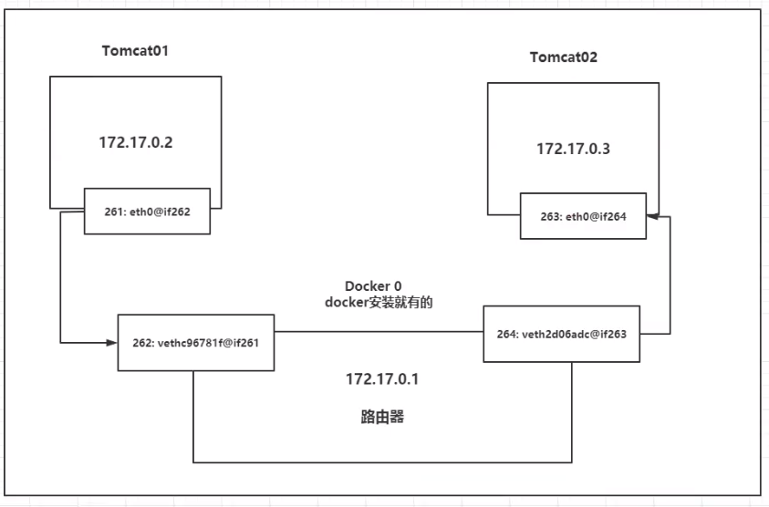
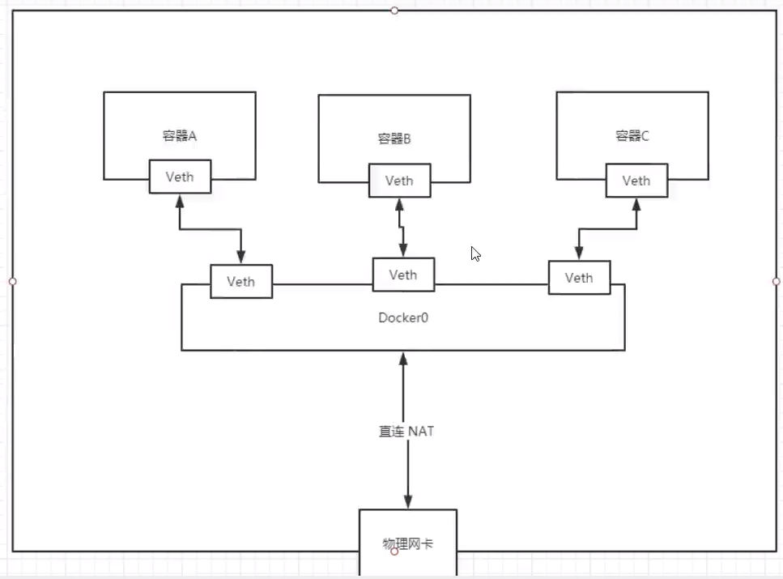
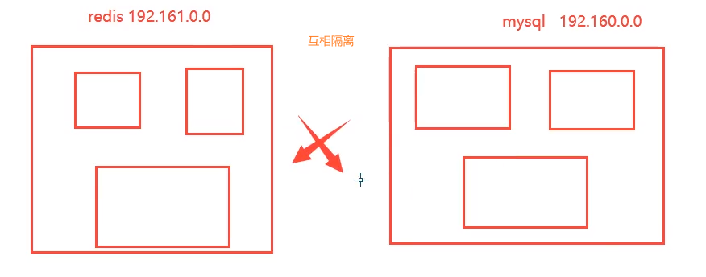
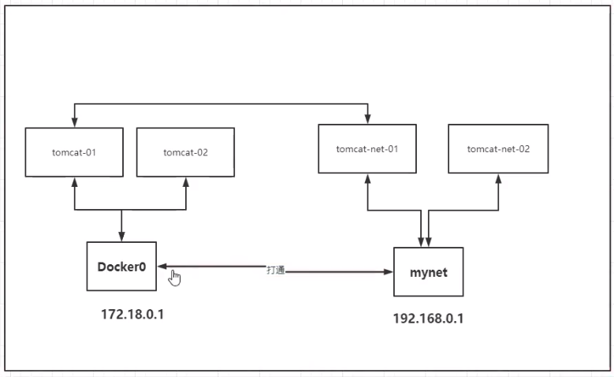

*运维篇*


# Docker网络

`docker network --help`


## 理解Docker0

> ip addr 命令

查看机器上的网卡

```shell
1: lo: <LOOPBACK,UP,LOWER_UP> mtu 65536 qdisc noqueue state UNKNOWN group default qlen 1000
    link/loopback 00:00:00:00:00:00 brd 00:00:00:00:00:00
    inet 127.0.0.1/8 scope host lo             # 本机回环地址
       valid_lft forever preferred_lft forever
    inet6 ::1/128 scope host
       valid_lft forever preferred_lft forever
2: eth0: <BROADCAST,MULTICAST,UP,LOWER_UP> mtu 1500 qdisc pfifo_fast state UP group default qlen 1000
    link/ether 52:54:00:36:58:3e brd ff:ff:ff:ff:ff:ff
    inet 172.17.0.8/20 brd 172.17.15.255 scope global eth0  # 云服务器内网地址
       valid_lft forever preferred_lft forever
    inet6 fe80::5054:ff:fe36:583e/64 scope link
       valid_lft forever preferred_lft forever
3: docker0: <NO-CARRIER,BROADCAST,MULTICAST,UP> mtu 1500 qdisc noqueue state DOWN group default
    link/ether 02:42:b7:f6:39:27 brd ff:ff:ff:ff:ff:ff
    inet 172.18.0.1/16 brd 172.18.255.255 scope global docker0  # docker0地址
       valid_lft forever preferred_lft forever
    inet6 fe80::42:b7ff:fef6:3927/64 scope link
       valid_lft forever preferred_lft forever
```


> docker的容器网络访问原理

我们发现这个容器带来网卡，都是一对对的

veth-pair 就是一对的虚拟设备接口，他们都是成对出现的，一端连着协议，一端彼此相连

正因为有这个特性 veth-pair 充当一个桥梁，连接各种虚拟网络设备的

OpenStac，Docker容器之间的连接，OVS的连接，都是使用evth-pair技术


容器之间公用一个路由器，就是 Docker0

所有的容器不指定网络的情况下，都是docker0路由的，docker会给我们的容器分配一个默认的可用ip。

	


Docker使用的是Linux的桥接，宿主机是一个Docker容器的网桥 docker0

	


> --link

==思考==：我们编写了一个微服务，项目连接数据库 database url=ip。如何做到当数据库重启时，项目不用重启。如何不依赖数据库的 ip 。如何通过名字来访问容器？


--link 实际上是在 容器的hosts中添加了一条配置

缺点（不建议使用）

* 一次单向配置
* 硬编码配置，ip 变更则无效


## 自定义网络

**网络模式**

bridge ：桥接 docker（默认，自己创建也是用bridge模式）

none ：不配置网络，一般不用

host ：和所主机共享网络

container ：容器网络连通（用得少！局限很大）


```shell
# 我们直接启动的命令 --net bridge,而这个就是我们得docker0
# bridge就是docker0
# docker0，特点：默认，域名不能访问。 --link可以打通连接，但是很麻烦！
# 等价于 => docker run -d -P --name tomcat01 --net bridge tomcat
$ docker run -d -P --name tomcat01 tomcat  

# 我们可以 自定义一个网络
# --driver bridge 网络模式：桥接
# --subnet 创建子网网络
# --gateway 设置网关（路由）ip地址
$ docker network create --driver bridge --subnet 192.168.0.0/16 --gateway 192.168.0.1 mynet
```


推荐使用，好处：

* 可以通过服务名互相ping通
* 为不同集群创建不同的网络，保证集群式是安全和健康的


	


**网络特征对比**

| features       | docker0                 | 自定义网络 |
| -------------- | ----------------------- | ---------- |
| 通过容器名连接 | 不支持，需要通过 --link | 支持       |
| 网络隔离       | 不支持                  | 支持       |


## 网络连通

不同网络（自定义网络）之间可以连通

> 如何让 docker0  和 我们自定义网络 打通？？ 实现不同网络内的容器互相访问？？

	


`docker network connect  NETWORK CONTAINER`

连通之后，通过 `docker network inspect` 查看


==实现原理：==让一个容器有多个 ip 地址，类似于 公网ip、内网ip


==思考==：docker 提供了容器的维护来连接网络，如果容器很多，操作比较繁琐！！！？？？


## 实战：部署Redis集群

集群需要建设专属redis网络（等同网卡）


网络设计图

	

1. 创建网卡

```shell
docker network create redis --subnet 172.58.0.0/16

[root@centos7 ~] docker network ls
NETWORK ID     NAME      DRIVER    SCOPE
16d205ef45c9   redis     bridge    local
[root@centos7 ~] docker network inspect 16d205ef45c9
[
    {
        "Name": "redis",
        "Id": "16d205ef45c954d9b2e9b65a7407ec240a6a58ea42e08cce6275681d9f3193ca",
        "Created": "2021-06-25T11:42:35.685805699+08:00",
        "Scope": "local",
        "Driver": "bridge",
        "EnableIPv6": false,
        "IPAM": {
            "Driver": "default",
            "Options": {},
            "Config": [
                {
                    "Subnet": "172.58.0.0/16"
                }
            ]
        },
        "Internal": false,
        "Attachable": false,
        "Ingress": false,
        "ConfigFrom": {
            "Network": ""
        },
        "ConfigOnly": false,
        "Containers": {},
        "Options": {},
        "Labels": {}
    }
]
```


2. 通过脚本创建 6 个==redis 配置==，脚本直接在 linux 终端运行

```shell
for port in $(seq 1 6);\
do \
mkdir -p /home/redis/node-${port}/conf
touch /home/redis/node-${port}/conf/redis.conf
cat << EOF >> /home/redis/node-${port}/conf/redis.conf
port 6379
bind 0.0.0.0
cluster-enabled yes
cluster-config-file nodes.conf
cluster-node-timeout 5000
cluster-announce-ip 172.58.0.1${port}
cluster-announce-port 6379
cluster-announce-bus-port 16379
appendonly yes
EOF
done

root@centos7 ~] ls /home/redis/
node-1  node-2  node-3  node-4  node-5  node-6
[root@centos7 ~] cat /home/redis/node-1/conf/redis.conf
port 6379
bind 0.0.0.0
cluster-enabled yes
cluster-config-file nodes.conf
cluster-node-timeout 5000
cluster-announce-ip 172.58.0.11
cluster-announce-port 6379
cluster-announce-bus-port 16379
appendonly yes
```


3. 通过脚本运行六个redis

```shell
for port in $(seq 1 6);\
do \
docker run -p 637${port}:6379 -p 1667${port}:16379 --name redis-${port} \
-v /home/redis/node-${port}/data:/data \
-v /home/redis/node-${port}/conf/redis.conf:/etc/redis/redis.conf \
-d --net redis --ip 172.58.0.1${port} redis:5.0.12 redis-server /etc/redis/redis.conf
done


[root@centos7 ~] docker ps
CONTAINER ID   IMAGE          COMMAND                  CREATED         STATUS         PORTS                                                                                      NAMES
7406b493bf1c   redis:5.0.12   "docker-entrypoint.s…"   3 seconds ago   Up 2 seconds   0.0.0.0:6376->6379/tcp, :::6376->6379/tcp, 0.0.0.0:16676->16379/tcp, :::16676->16379/tcp   redis-6
f6a0caf4896d   redis:5.0.12   "docker-entrypoint.s…"   4 seconds ago   Up 2 seconds   0.0.0.0:6375->6379/tcp, :::6375->6379/tcp, 0.0.0.0:16675->16379/tcp, :::16675->16379/tcp   redis-5
c2d33d23ab70   redis:5.0.12   "docker-entrypoint.s…"   4 seconds ago   Up 3 seconds   0.0.0.0:6374->6379/tcp, :::6374->6379/tcp, 0.0.0.0:16674->16379/tcp, :::16674->16379/tcp   redis-4
7700ff1db864   redis:5.0.12   "docker-entrypoint.s…"   5 seconds ago   Up 4 seconds   0.0.0.0:6373->6379/tcp, :::6373->6379/tcp, 0.0.0.0:16673->16379/tcp, :::16673->16379/tcp   redis-3
f582713f6731   redis:5.0.12   "docker-entrypoint.s…"   6 seconds ago   Up 5 seconds   0.0.0.0:6372->6379/tcp, :::6372->6379/tcp, 0.0.0.0:16672->16379/tcp, :::16672->16379/tcp   redis-2
82e37cdbe102   redis:5.0.12   "docker-entrypoint.s…"   6 seconds ago   Up 5 seconds   0.0.0.0:6371->6379/tcp, :::6371->6379/tcp, 0.0.0.0:16671->16379/tcp, :::16671->16379/tcp   redis-1
```


4. 创建集群

```shell
# 先进入一台redis
# redis默认没有bash，只有sh
docker exec -it redis-1 /bin/sh  


redis-cli --cluster create 172.58.0.11:6379 172.58.0.12:6379 172.58.0.13:6379 172.58.0.14:6379 172.58.0.15:6379 172.58.0.16:6379  --cluster-replicas 1

# 执行日志
>>> Performing hash slots allocation on 6 nodes...
Master[0] -> Slots 0 - 5460
Master[1] -> Slots 5461 - 10922
Master[2] -> Slots 10923 - 16383
Adding replica 172.58.0.15:6379 to 172.58.0.11:6379
Adding replica 172.58.0.16:6379 to 172.58.0.12:6379
Adding replica 172.58.0.14:6379 to 172.58.0.13:6379
M: 2b12d41bd77115201affb56543751cce12c599b4 172.58.0.11:6379
   slots:[0-5460] (5461 slots) master
M: 67f417b4b7284501648d347d2df396d919f04423 172.58.0.12:6379
   slots:[5461-10922] (5462 slots) master
M: 126358ed9dccbf5e821ee4c4e63c064bd692a63c 172.58.0.13:6379
   slots:[10923-16383] (5461 slots) master
S: 81faaffe27da70552c17ae2edbec805c22854c03 172.58.0.14:6379
   replicates 126358ed9dccbf5e821ee4c4e63c064bd692a63c
S: 9b4cfe2136879e261699d0d2b1796a6f001890d3 172.58.0.15:6379
   replicates 2b12d41bd77115201affb56543751cce12c599b4
S: 822d8df38b629ba5343629ce914f552f75d5cb7a 172.58.0.16:6379
   replicates 67f417b4b7284501648d347d2df396d919f04423
Can I set the above configuration? (type 'yes' to accept): yes
>>> Nodes configuration updated
>>> Assign a different config epoch to each node
>>> Sending CLUSTER MEET messages to join the cluster
Waiting for the cluster to join
.
>>> Performing Cluster Check (using node 172.58.0.11:6379)
M: 2b12d41bd77115201affb56543751cce12c599b4 172.58.0.11:6379
   slots:[0-5460] (5461 slots) master
   1 additional replica(s)
M: 126358ed9dccbf5e821ee4c4e63c064bd692a63c 172.58.0.13:6379
   slots:[10923-16383] (5461 slots) master
   1 additional replica(s)
S: 81faaffe27da70552c17ae2edbec805c22854c03 172.58.0.14:6379
   slots: (0 slots) slave
   replicates 126358ed9dccbf5e821ee4c4e63c064bd692a63c
S: 822d8df38b629ba5343629ce914f552f75d5cb7a 172.58.0.16:6379
   slots: (0 slots) slave
   replicates 67f417b4b7284501648d347d2df396d919f04423
M: 67f417b4b7284501648d347d2df396d919f04423 172.58.0.12:6379
   slots:[5461-10922] (5462 slots) master
   1 additional replica(s)
S: 9b4cfe2136879e261699d0d2b1796a6f001890d3 172.58.0.15:6379
   slots: (0 slots) slave
   replicates 2b12d41bd77115201affb56543751cce12c599b4
[OK] All nodes agree about slots configuration.
>>> Check for open slots...
>>> Check slots coverage...
[OK] All 16384 slots covered.
```


5. 测试集群  

redis-cli -c  进入集群环境，==注意== -c 表示集群，没有 -c 表示单机

redis 集群默认开启主从复制

```shell
$ redis-cli -c
127.0.0.1:6379> cluster info
cluster_state:ok
cluster_slots_assigned:16384
cluster_slots_ok:16384
cluster_slots_pfail:0
cluster_slots_fail:0
cluster_known_nodes:6
cluster_size:3   #集群数量3，主从复制
cluster_current_epoch:6
cluster_my_epoch:1
cluster_stats_messages_ping_sent:237
cluster_stats_messages_pong_sent:237
cluster_stats_messages_sent:474
cluster_stats_messages_ping_received:232
cluster_stats_messages_pong_received:237
cluster_stats_messages_meet_received:5
cluster_stats_messages_received:474
```

主从情况

```shell
127.0.0.1:6379> cluster nodes
126358ed9dccbf5e821ee4c4e63c064bd692a63c 172.58.0.13:6379@16379 master - 0 1624597808000 3 connected 10923-16383
81faaffe27da70552c17ae2edbec805c22854c03 172.58.0.14:6379@16379 slave 126358ed9dccbf5e821ee4c4e63c064bd692a63c 0 1624597808000 4 connected
822d8df38b629ba5343629ce914f552f75d5cb7a 172.58.0.16:6379@16379 slave 67f417b4b7284501648d347d2df396d919f04423 0 1624597808578 6 connected
2b12d41bd77115201affb56543751cce12c599b4 172.58.0.11:6379@16379 myself,master - 0 1624597807000 1 connected 0-5460
67f417b4b7284501648d347d2df396d919f04423 172.58.0.12:6379@16379 master - 0 1624597809000 2 connected 5461-10922
9b4cfe2136879e261699d0d2b1796a6f001890d3 172.58.0.15:6379@16379 slave 2b12d41bd77115201affb56543751cce12c599b4 0 1624597809579 5 connected
```


设置值，查看设置的机器情况

```shell
127.0.0.1:6379> set a b
-> Redirected to slot [15495] located at 172.58.0.13:6379  # 将值设置到了 13 节点
OK
```


把主机下线了，对应Slave会自动变成Master，Slave 有Master的所有值，这就是高可用。


## 实战：SpringBoot微服务镜像

将SpringBoot微服务打包成Docker镜像

1、构建SpringBoot项目

2、打包运行

```shell
mvn package
```

3、编写dockerfile

```shell
FROM java:8
COPY *.jar /app.jar
CMD ["--server.port=8080"]
EXPOSE 8080
ENTRYPOINT ["java","-jar","app.jar"]
```

4、构建镜像

1. 复制jar和DockerFIle到服务器

2. 构建镜像

```shell
docker build -t xxxxx:xx  .
```


5、发布运行

以后我们使用了Docker之后，给别人交付就是一个镜像即可！


# 企业实战


# Docker Compose


# Docker Swarm


# CI/CD Jenkis

